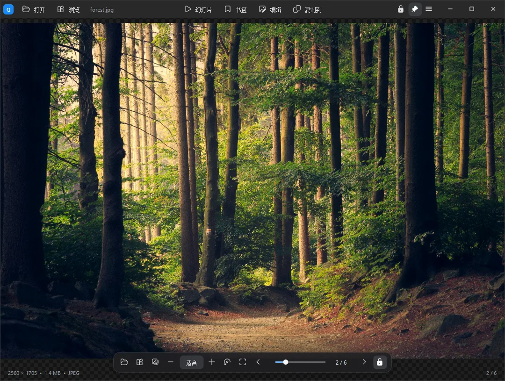
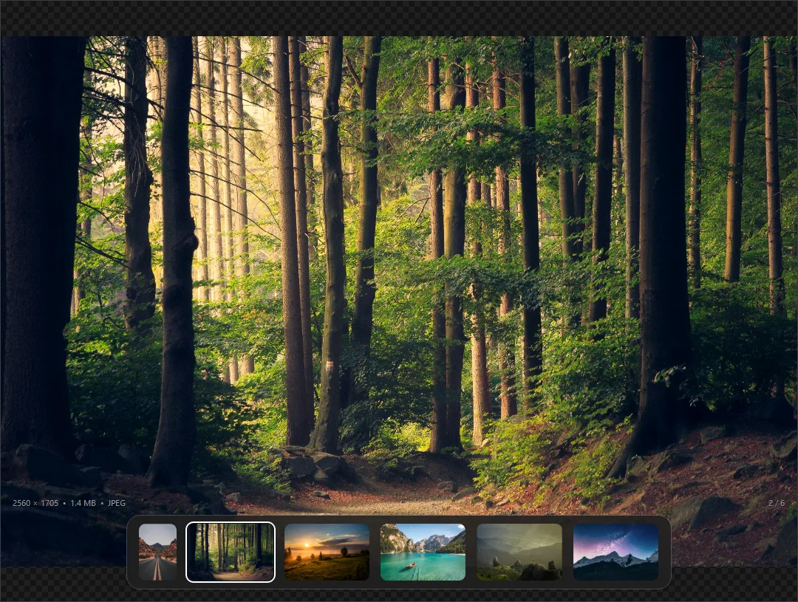
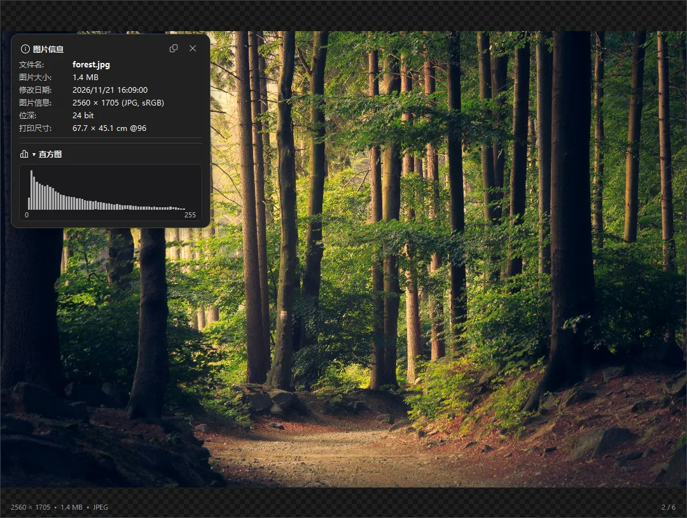
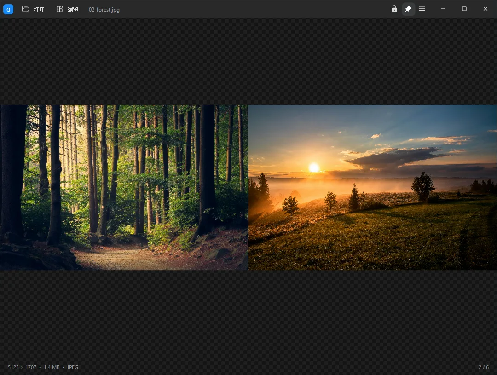
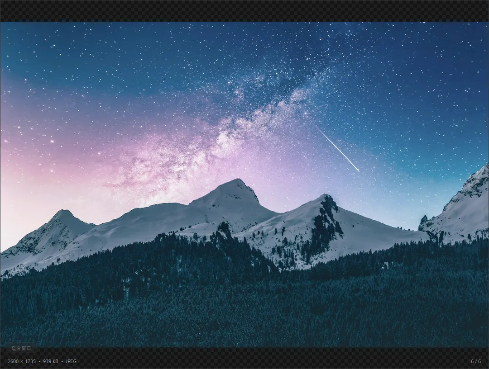
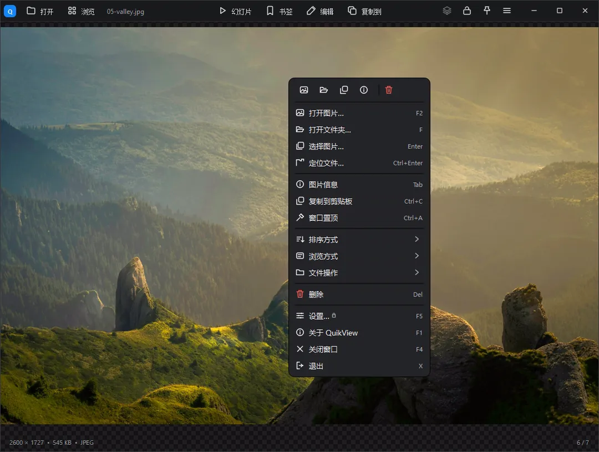
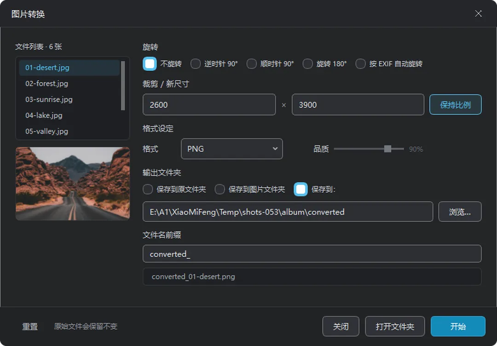
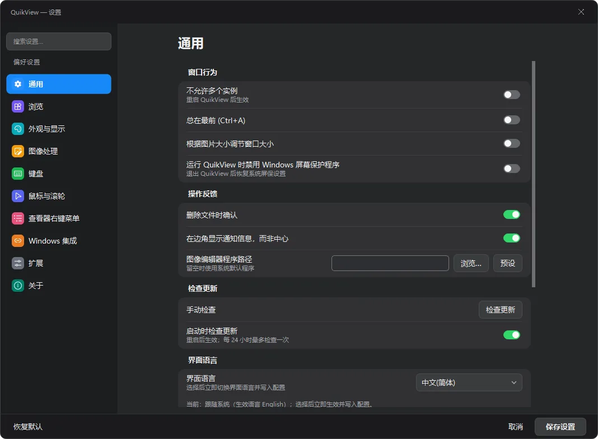
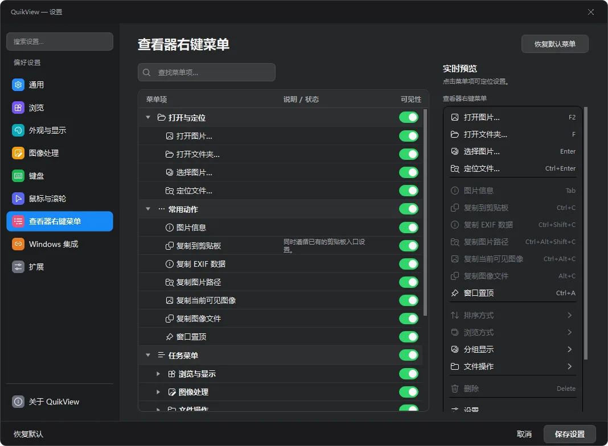
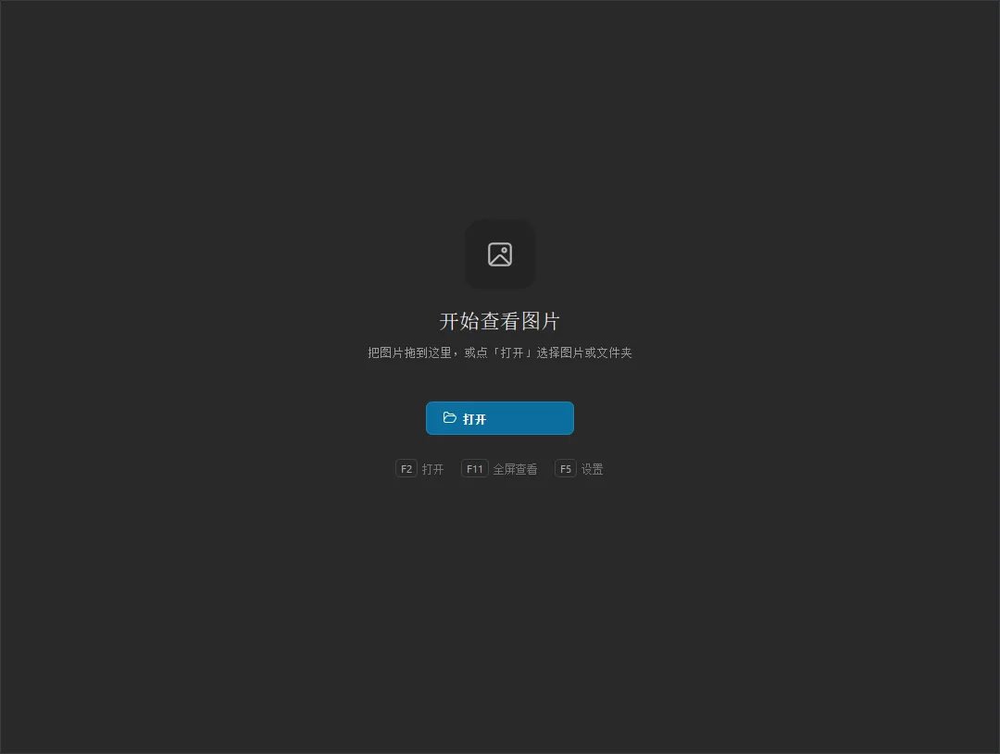

# 界面一览 · Screenshots

[← 返回 README](../README.md)

> 本页图集基于 **SoleView 0.6.1** 界面（2026-11-26 重拍，tag `v0.6.1`）。

以下截图全部由 **SoleView 自身渲染**（`--screenshot` 走 Qt 内部绘制，不是系统抓屏），
所以不受显示器 DPI 缩放影响，和你在屏幕上看到的一致。

Every screenshot below is rendered by SoleView itself (`--screenshot`, Qt's own painting),
not captured from the screen — so it is DPI-independent and matches what you actually see.

---

## 1. 打开即看 · Open and view

双击图片直接看。顶部栏和底部胶囊浮在画面上，鼠标移开就淡出，画面永远是满的。

Double-click any image. The top strip and bottom capsule float over the picture and fade out
when the pointer leaves — the image always gets the whole window.

---

## 2. 缩略图浏览 · Thumbnail browser

底部横向胶片栏：按可见范围异步生成缩略图，保留照片比例，支持滚轮浏览；点击切换时当前项高亮并自动居中，开合不推动主图与控制栏。

A horizontal filmstrip along the bottom: thumbnails are generated asynchronously for the visible
range, keep their aspect ratio, and scroll with the wheel. Clicking one highlights and centers it;
opening or closing the strip never shifts the image or the control island.

---

## 3. 图片信息 · Image info

`Tab` 呼出左上角信息卡片：文件名、体积、修改时间、位深、相机制造商 / 型号 / 软件、拍摄时间、
GPS（可一键在地图上查看），直方图折叠在底部。卡片浮在画面上，不挤压图片。EXIF 是自研解析器，
不依赖任何 GPL 库。

`Tab` brings up the info card at the top-left: file name, size, modified time, bit depth, camera
make / model / software, capture time, GPS (with a "show on map" link), and a collapsible
histogram. The card floats over the image instead of squeezing it. The EXIF parser is our own —
no GPL dependency.

---

## 4. 双页阅览 · Double-page spread

画册、漫画、扫描件并排看，缩放到跨页宽度，翻页一次翻两页。

For photo books, comics and scans: two pages side by side at spread width, one keypress per spread.

---

## 5. 1:1 看像素 · 100% pixel view

点底部缩放胶囊切到 100%，照片按原始像素显示，树叶纹理和噪点都不被插值抹掉。

Tap the zoom capsule to switch to 100%: the photo is shown pixel for pixel, so fine texture and
grain stay visible instead of being smoothed away.

---

## 6. 图像效果 · Image effects

反色、Gamma 校正、旋转、翻转、缩放插值（最近邻 / 双线性 / Lanczos）。只影响显示，不动原文件。

Invert, gamma, rotate, flip, and resampling mode (nearest / bilinear / Lanczos).
Display only — the file on disk is untouched.

---

## 7. 右键菜单 · Context menu

顶部是快捷操作条，下面按「打开与定位 / 常用动作 / 任务菜单 / 危险操作 / 应用」分组，每项带快捷键；
哪一组不要，可以在设置页里单独关掉，关闭的分组不会留下空行。

A quick-action bar on top, then five groups — open & locate, everyday actions, task menu, dangerous
operations, app. Each item shows its shortcut. Any group can be switched off in settings, and a closed
group leaves no empty divider behind.

---

## 8. 批量转换 · Batch convert

格式、尺寸、质量、输出目录一次设好，整个列表一起转。原文件默认保留。

Format, size, quality and output folder set once — the whole file list converts in one go.
Originals are kept by default.

---

## 9. 设置 · Settings

左侧十个分类，右侧就地生效的选项：通用、浏览、外观与显示、图像处理、键盘、鼠标与滚轮、查看器右键菜单、Windows 集成、扩展、关于。

Ten categories on the left, options on the right: general, browsing, appearance & display, image
processing, keyboard, mouse & wheel, viewer right-click menu, Windows integration, extensions,
and About.

---

## 10. 查看器右键菜单（设置页） · Viewer context menu settings

0.5.3 新增的独立设置页：左侧是可折叠的菜单大纲（打开定位、常用、任务菜单、危险操作、应用五组各有总开关），
右侧是实时预览。顶部搜索框能按菜单项名定位，改动即时写进预览和外层右键菜单。

The settings page added in 0.5.3: a collapsible outline on the left (five groups, each with a master
switch), a live preview on the right. The search box jumps to a menu item by name, and edits apply
to the preview and the real context menu immediately.

---

## 11. 启动画面 · Start screen

没打开图的时候也不空着：拖进来、选图片、或者直接打开整个文件夹。

Nothing open? Drop a file in, pick one, or open a whole folder.

---

## 关于示例照片 · About the sample photos

截图里的照片来自 [Unsplash](https://unsplash.com/license)（Unsplash License，可免费使用、无需署名），
照片 ID 与授权记录见 [ATTRIBUTION.md](ATTRIBUTION.md) 第 6 节。
它们**只出现在截图里**，不随程序分发，也不在仓库的其它位置出现。

The photos come from [Unsplash](https://unsplash.com/license) under the Unsplash License;
photo IDs and the attribution record are in section 6 of [ATTRIBUTION.md](ATTRIBUTION.md).
They appear **only inside these screenshots** and are not shipped with the program.
